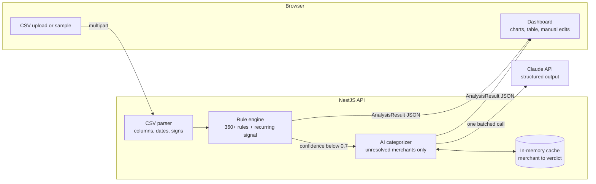

# Ledgerlens

**Bank statement analyzer: rules first, AI only where rules run out.** Upload a CSV export from your bank and get a spending dashboard. A deterministic rule engine categorizes every transaction it recognises. Only the leftovers, the local cafés and cryptic merchant codes, go to Claude. Every row shows which step decided and why.

> **Live demo:** _coming soon_ · uses a synthetic sample statement, so there is no need to upload real bank data.

---

## Why this design

The easy version of this project sends every transaction to an LLM. That is slow, costs money per row, gives different answers on different runs, and sends financial data to a third party for no reason. Most transactions don't need judgment: `NETFLIX.COM` is a subscription and `PAYROLL DIRECT DEP` is income.

So the pipeline puts the cheap, predictable step first:

| Step | What it does | On the sample (200 rows) |
|---|---|---|
| **Parse** | Finds the header row (skipping bank preambles), maps columns, detects the date format and the sign convention | 200 rows, 0 skipped, `MM/DD/YYYY` detected |
| **Rules** | 360+ merchant names, keywords and money-flow patterns, plus a recurring-charge detector | **173 rows (87%)** in ~10 ms |
| **Claude** | Only the unresolved merchants, **each sent once**, in a single call with a strict JSON schema | 18 merchants |
| **You** | Change any category; the app offers to apply it to the same merchant | — |

## Highlights

| | |
|---|---|
| **Real-world CSV parsing** | One signed `Amount` column, separate `Debit`/`Credit` columns, or a `DR/CR` type column. Comma or semicolon files, `1,234.56` or `1.234,56`, `(12.50)` negatives, account-info lines above the header, and files with no header at all. |
| **Date-order detection** | Is `03/04/2026` 3 April or March 4? The parser reads every date in the file: a first part above 12 proves DD/MM, a second part above 12 proves MM/DD. If nothing proves it, the dashboard says which one it assumed. |
| **Explainable rules** | Each merchant and keyword is its own rule with an id (`merchant:NETFLIX`, `keyword:COFFEE`, `pattern:salary`). The longest match wins, so `AMAZON PRIME` beats `AMAZON` and `UBER EATS` beats `UBER`. Rules can depend on money direction: `PAYROLL` counts as income only when money comes in. |
| **Recurring-charge signal** | An unknown merchant that charges 3+ times, 25–35 days apart, with amounts within 10%, is a subscription whatever its name. This catches apps no list will ever know. |
| **Confidence threshold** | Known merchants score 0.95, generic keywords 0.8, the recurring signal 0.75. Anything below 0.7 goes to the AI step. |
| **Narrow AI step** | Claude gets the category list with one-line definitions, the masked description and the money direction. That's all: no amounts, dates or account numbers. It may answer `unknown`, and a wrong guess counts as worse than no guess. Results are cached per merchant, so re-running the sample costs no API calls. |
| **Degrades gracefully** | No API key, a timeout, a rate limit or a refusal: the rules' results still show, and the leftovers stay "Not sorted" with a clear note. |
| **Privacy by design** | Stateless: no database. Files are parsed in memory and dropped. Upload size and request rate are limited. |
| **Dashboard** | Spending by category (click to filter everything), spending per week or month with an average line, largest payments, totals, and a table with search, sort, "Needs review" filter, inline recategorize, undo and CSV export. |

## Architecture



Categories and API types live in `packages/shared`, used by both the server and the web app.

### Where to look

| File | What's in it |
|---|---|
| [`apps/server/src/parsing/csv-statement.parser.ts`](apps/server/src/parsing/csv-statement.parser.ts) | Header detection, column mapping, headerless fallback |
| [`apps/server/src/parsing/amount.ts`](apps/server/src/parsing/amount.ts), [`dates.ts`](apps/server/src/parsing/dates.ts) | Number and date formats, DD/MM vs MM/DD |
| [`apps/server/src/categorization/rules.ts`](apps/server/src/categorization/rules.ts) | The rule lists and patterns |
| [`apps/server/src/categorization/rule-engine.ts`](apps/server/src/categorization/rule-engine.ts) | Matching, threshold, recurring-charge detection |
| [`apps/server/src/categorization/ai-categorizer.service.ts`](apps/server/src/categorization/ai-categorizer.service.ts) | The Claude call: prompt, Zod schema, batching, cache, error handling |
| [`apps/server/src/sample/sample-statement.ts`](apps/server/src/sample/sample-statement.ts) | Seeded synthetic statement generator |
| [`apps/web/src/lib/stats.ts`](apps/web/src/lib/stats.ts) | Totals, per-category and per-period spending |

## Tech stack

- **Frontend:** React 19, TypeScript, Vite, Tailwind CSS v4, Recharts
- **Backend:** NestJS 11, Papa Parse, `@anthropic-ai/sdk` with Zod structured output, `@nestjs/throttler`
- **AI:** Claude (`claude-opus-5` by default, low effort; set `AI_MODEL` to change it)
- **Tests:** Jest + Supertest (server), Vitest + Testing Library (web), GitHub Actions CI
- **Hosting:** Vercel (web), Render (API)

## Run it locally

Needs Node 20+.

```bash
npm install
cp apps/server/.env.example apps/server/.env   # add ANTHROPIC_API_KEY to enable the AI step
npm run dev                                     # API on :3000, web on :5173
```

Without an API key everything works except the AI step: unresolved rows stay "Not sorted".

```bash
npm test        # 91 tests: parser, rules, AI service (mocked client), HTTP endpoints, stats, reducer, UI
npm run sample  # regenerate apps/web/public/sample-statement.csv
```

## API

| Method | Path | |
|---|---|---|
| `POST` | `/api/statements/analyze` | multipart, field `file`, CSV up to 1 MB |
| `POST` | `/api/statements/sample` | analyze the built-in synthetic statement |
| `GET` | `/api/statements/sample.csv` | download the sample |
| `GET` | `/health` | `{ status, ai: "enabled" \| "disabled" }` |

A file that can't be parsed returns `422` with a message saying what's missing.

## Limits and next steps

- CSV only. PDF statements need text extraction plus per-bank layout rules, planned as a separate parser behind the same interface.
- One currency per file.
- Manual changes are not remembered between sessions (no accounts, by design). A natural next step is to turn corrections into user-specific rules.
- The rule lists are US/UK-oriented.

---

Built by [Narek Danielyan](https://danielyan99.github.io/cv-website/).
